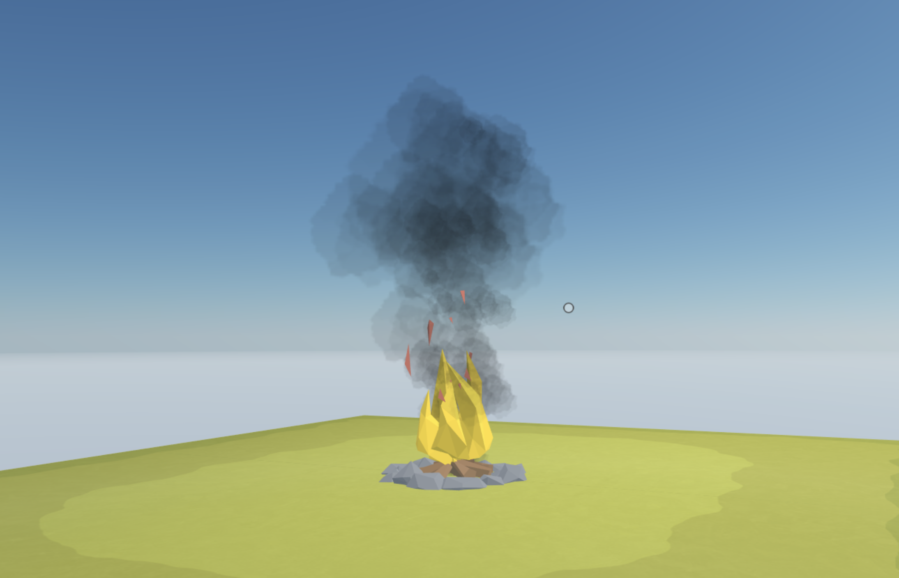

## Smoke scene

This simple scene shows how to handle a particle system to create smoke. 




This scene shows you:
- How to use materials with transparency on a plane
- How to use billboards to keep a 2D plane always facing the player
- How to use a system to create a particle effect, spawnin and reusing multiple entities, changing their position and scale gradually
- Use an Entity pool to keep reusing the same entities instead of constantly creating new ones

There are two modules being used:

- `SmokeSource` defines a place from where smoke puffs spawn and an interval. To instance smoke puffs, it either uses idle entities from an object pool or creates new ones if they don't exist yet. 
- `Smoke` updates the position of the existing smoke puffs so that they rise and slowly move in a direction set by their `SmokeVelocity` component. When a smoke puff is too far from the source, it's removed from the scene.


## Try it out

**Install the CLI**

Download and install the Decentraland CLI by running the following command:

```bash
npm i -g decentraland
```

**Previewing the scene**

Download this example and navigate to its directory, then run:

```
$:  dcl start
```

Any dependencies are installed and then the CLI opens the scene in a new browser tab.

**Scene Usage**

Note how smoke starts rising from the fireplace. Puffs of smoke have random sizes and move in random directions, but they gradually grow and straighten upwards as time goes by.

Learn more about how to build your own scenes in our [documentation](https://docs.decentraland.org/) site.

If something doesn’t work, please [file an issue](https://github.com/decentraland-scenes/Awesome-Repository/issues/new).

## Copyright info

This scene is protected with a standard Apache 2 licence. See the terms and conditions in the [LICENSE](/LICENSE) file.
